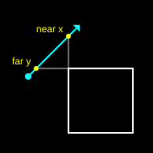

# Working on intersect

This repository is a tutorial that happens to also be a library. `noonat/intersect`
is a set of 2D collision detection routines — AABB and circle tests, intersection
and swept — written as a literate document and published to
<http://noonat.github.io/intersect>.

The tutorial is the point. The library is what falls out of it. Whenever the two
pull in different directions, readability of the tutorial wins.

## Working agreements

These come first because they are the easiest to get wrong.

**Never commit without approval, and never push without a second approval.**
They are two separate gates. Draft the commit message, show it, and wait. Once
the message is approved, ask again before pushing. "Yes, commit that" is not
permission to push.

**No bylines on commits.** No `Co-Authored-By`, no `Generated with`, no tool
attribution of any kind in the message. Subject lines are short and written in
the imperative. Many are subject-only — a body is for when there is genuinely
something to explain, not a habit. Semicolons in subject lines have been asked
against specifically.

Recent history is a fair guide to the house style:

```
Minor corrections to captions and prose
Drop code blocks below floated figures
Scale each example to its own view, and animate on demand
Draw the arrowheads as filled triangles
Colour the code, and keep the examples on a dark plate
Redesign the tutorial page
```

## The one rule about editing

**`src/intersect.ts.md` is the source of truth for both the prose and the
library code.** Every code block in that Markdown file is extracted, in order,
to produce `src/intersect.ts`.

Never edit `src/intersect.ts` directly. It is generated, it is committed, and
your edit will be silently reverted by the next build. The same goes for
`index.html`, `lib/`, `docs/bundle.*`, and `docs/docco.css`.

To change the library, edit the code block inside the Markdown. To change the
page's design, edit `template/docco.css` (which is copied to `docs/docco.css`)
or `template/docco.jst`.

## Build pipeline

`npm run build` runs `build.js`, which does four things:

1. **`compileSource()`** — parses `src/intersect.ts.md` with markdown-it, keeps
   only the code blocks, concatenates them, runs the result through Prettier,
   and writes `src/intersect.ts`. A blank line is inserted after any block that
   ended in a closing brace, because Markdown has no way to express the blank
   lines you would want between them.
2. **`compileHTML()`** — runs `docco` over the Markdown with
   `template/docco.jst` and `template/docco.css`, inlines the SVG figures (see
   below), formats with Prettier, and writes `index.html` at the repository
   root. docco's own output file is deleted afterwards.
3. **`compileLibrary()`** — `tsc` over `src/intersect.ts` into `lib/`.
4. **`compileExamples()`** — type checks `src/examples.ts` against
   `tsconfig.examples.json` (esbuild only strips types, so without this the
   examples are checked by nothing), then bundles to `docs/bundle.js`. The
   KaTeX stylesheet is imported by `examples.ts`, so esbuild also emits
   `docs/bundle.css` and the 60 hash-named KaTeX font files in `docs/`. Those
   hashed files are real build output, not cruft — leave them alone.

### Build output is committed, and CI checks it

The `build` job in `.github/workflows/ci.yml` runs `npm ci` (whose `prepare`
script builds everything) and then fails if `git status --porcelain` is
non-empty. **If you touch anything that feeds the build, run `npm run build`
and commit the result in the same commit.** A change to the Markdown, the
template, the CSS, the examples, or the SVGs all qualify.

### Commands

```
npm run build     # regenerate everything
npm test          # jest (66 tests) + eslint over src and test
npm run clean     # remove generated files
```

`npm test` is fast — under two seconds. There is no reason not to run it.

## The page design

The rendered page has a single design token system in `template/docco.css`,
declared three times so that theming works in all three states:

- bare `:root` — the light palette, the full set
- `@media (prefers-color-scheme: dark) { :root:not([data-theme="light"]) }` —
  system dark, unless the reader has explicitly chosen light
- `:root[data-theme="dark"]` — the toggle, which must beat the media query

A token defined only inside a media query has no light value and will break.
Define everything on bare `:root`, then override in the two dark blocks.

The token groups are:

- **Page** — `--paper --ink --hard --gray --soft --panel`
- **Diagrams** — `--d-ground --d-world --d-edge --d-quiet --d-query --d-clear
  --d-correct --d-collide --d-frame --d-label`
- **Syntax** — `--code-comment --code-keyword --code-string --code-number
  --code-title --code-type`

### The diagram colors carry meaning

This is not decoration and must not be casually re-tuned:

| Token | Meaning |
| --- | --- |
| `--d-clear` (green) | not colliding — the good outcome |
| `--d-collide` (red) | the colliding position or movement |
| `--d-correct` (amber) | the corrected position or movement |
| `--d-query` (blue) | the thing being tested, in static figures only |

The rejected state also carries a **diagonal hatch**, so the triad never
depends on hue alone — roughly one man in twelve has a red-green deficiency.
If you add a state, give it a texture as well as a color.

Blue and green never appear in the same diagram. The animated examples color
the sweep segment by outcome rather than using blue at all; only the static
figures use `--d-query`.

### Theme is applied before first paint

`template/docco.jst` has an inline script in `<head>` that reads
`localStorage["intersect-theme"]` and stamps `data-theme` on the root element,
so a chosen theme never flashes. The toggle in the colophon writes that key and
dispatches a `themechange` CustomEvent on the root, which `examples.ts` listens
for.

## Figures (the static SVGs)

Sources live in `docs/svg/*.svg`. They are referenced from the Markdown as
ordinary images:

```html
<figure class="right">
  
  <figcaption>Near x is greater than far y</figcaption>
</figure>
```

**They are inlined into `index.html` at build time, not linked.** An
``-embedded SVG is an isolated document: it cannot read the page's custom
properties, so it could neither pick up the diagram palette nor follow the
theme toggle. `inlineFigure()` in `build.js` strips each file's `<defs>`,
`<style>`, `#background` rect and hardcoded `fill=`/`stroke=` attributes, maps
its class names onto semantic ones, and emits `<svg class="figure" viewBox=…>`.

The class mapping, from the SVG source's names to the stylesheet's:

| In `docs/svg/` | In the page |
| --- | --- |
| `static` | `d-world` |
| `static-edge` | `d-edge` |
| `static-text` | `d-text` |
| `segment` | `d-query` |
| `good` | `d-clear` |
| `bad` | `d-collide` |
| `hit` | `d-correct` |
| `quiet` | `d-quiet` |

Markers (`#fig-arrow`, `#fig-dot`) and the hatch patterns (`#fig-hatch`,
`#fig-hatch-quiet`) are defined **once** in `template/docco.jst`, not per file
— eleven copies of the same ids in one document collide, and the browser
resolves to whichever it saw first.

`build.js` throws if the number of figures it inlined does not match the number
of distinct files it found, so a typo in a path fails the build rather than
producing a broken page.

Note that `class="small"` on the `` is vestigial: the whole element is
replaced, so the class goes with it. Layout comes from `figure`, `figure.right`
and `.figure-row` in the stylesheet.

### SVG gotchas that have already cost time

- **Presentation attributes do not accept `var()`.** `stroke="var(--d-collide)"`
  fails silently. It has to be a CSS rule.
- **A CSS `fill` declaration overrides a `fill=` attribute**, not the other way
  round. That is why `build.js` strips the baked-in colors.
- **`patternTransform="rotate(45)"` rendered empty** in testing. The hatch is a
  self-tiling diagonal path instead.
- **`.figure text` sets the font size centrally.** Do not rely on a per-role
  rule; a label whose role has no size rule will inherit the page's 16px and
  blow out the diagram.

## Animated examples (the canvases)

`src/examples.ts` is a single bundle that finds each heading by id and inserts a
`<figure class="example">` immediately after it. The registry near the bottom
of the file maps id → constructor → content bounds → caption:

```ts
{
  id: "aabb-vs-point",
  constructor: AABBPointExample,
  content: [64, 32],
  caption: "The point is red while it is inside the box. …"
}
```

`content` is the extent the example actually draws into. The view is scaled to
fill its frame from that, which matters: before this existed, the first example
drew into about five per cent of its canvas.

Things worth knowing before editing this file:

- **A canvas cannot read a custom property.** `color(role)` resolves the
  `--d-*` tokens once via `getComputedStyle`, caching the result;
  `forgetColors()` drops the cache on `themechange` and on a
  `prefers-color-scheme` change. It resolves against the *first canvas*, not
  the root, because `.example` overrides the tokens.
- **The examples keep the dark plate in both themes.** `.example` redeclares
  the diagram tokens. They run nearly the full column width and are mostly
  empty space, so on white the thin strokes had nothing to sit against. The
  static figures are small enough to read as line art and follow the page.
- **Zoom is applied to coordinates, not to the context transform**
  (`toX()`/`toY()`), so boxes scale while stroke weights, arrowheads and
  hatching stay the size they were drawn at.
- **The backing store follows `devicePixelRatio`**; the context is scaled once
  in `resize()` so the drawing code works in CSS pixels.
- **Only visible examples animate.** An `IntersectionObserver` with
  `rootMargin: "100px"` gates the per-example `tick()`. Loading the page with
  the `#animate-all` fragment disables that, which is what you want when
  screenshotting a section further down the page.
- The rAF step is clamped to `1/15`s so returning to a backgrounded tab does
  not jump.

## Math (KaTeX)

Formulas are written as `\\(…\\)` and `\\[…\\]` in the Markdown and rendered in
the browser by `renderMathInElement`, called at the top of the `ready()` block
in `src/examples.ts`.

A few terms are colored so the prose can point at them — the three terms of the
quadratic are `\htmlClass{m-a}{…}`, `m-b` and `m-c`, styled in
`template/docco.css` against `--d-collide`, `--d-clear` and `--d-query`.
**They use class names rather than KaTeX's `\color`, which takes a literal
that would then be wrong in one theme or the other.** `\htmlClass` needs KaTeX's
`trust` option, granted only to that one command; trusting it is not enough on
its own, because `strict` warns about the HTML extension separately, once per
formula, so `htmlExtension` is ignored there.

A formula wider than the column scrolls in its own box, the way a long line of
code does — left to itself it widens the whole document and shifts every other
element with it. Display math is centered with `justify-content: safe center`,
so an overflowing formula falls back to starting at the left edge instead of
putting its left half out of reach.

## Prose and captions

The document is written for someone meeting this material for the first time.
Match that: short sentences, plain words, second person, British-ish restraint.
Some repetition is deliberate — the AABB acronym is re-expanded on purpose to
reinforce it for a novice reader. Do not "tidy" that away.

When you change a figure, **read its caption against what the figure actually
draws.** Several captions have been wrong in exactly this way — describing a
comparison the diagram did not make, or naming the wrong axis.

Headings drive both the contents rail and the example mounting, so renaming one
changes its generated id and will silently detach any example bound to it.
Grep `src/examples.ts` for the id before renaming a heading.

## Layout gotchas

- **Type is sized from the reading column, not the viewport.** `.page` is a
  `container-type: inline-size` container and the type scale uses `cqi`. With
  viewport units, iOS Display Zoom set to "Larger Text" hits the text twice —
  once through the system size and again through the narrowed viewport.
- **`pre` has `overflow-x: auto`, which makes it a block formatting context**,
  so it shrinks to avoid floated figures. `.highlight { clear: both }` drops
  code below the figures instead of letting them squeeze it.
- **docco's first section runs from the title all the way to the first code
  block**, so `.header` wraps considerably more than the intro. The standfirst
  styling is scoped with `.header > h2 ~ p` to avoid catching it all.
- Verifying in headless Chrome has produced false alarms more than once —
  apparent horizontal overflow from a window/viewport mismatch, a stray
  compositing artifact in a tall capture, and duplicate SVG ids introduced by a
  harness that cloned nodes. Check the harness before believing the bug.

## Repository layout

```
src/intersect.ts.md     the literate source — prose and library code
src/intersect.ts        GENERATED from the above
src/examples.ts         the animated canvas examples, bundled to docs/
src/css.d.ts            lets TypeScript accept the KaTeX stylesheet import
template/docco.jst      page template: defs, contents rail, theme toggle
template/docco.css      the whole design system
docs/svg/*.svg          static figure sources, inlined at build time
docs/fonts/*.woff2      IBM Plex Sans, Inter Tight, JetBrains Mono (variable)
docs/docco.css          GENERATED copy of template/docco.css
docs/bundle.{js,css}    GENERATED by esbuild
docs/[A-Z0-9]{8}.*      GENERATED KaTeX font assets
index.html              GENERATED — the published page
lib/                    GENERATED — the compiled npm package
test/*.test.ts          jest tests against the library
```

`docs/public/` (Aller, Novecento, Roboto Black, the fleurons font, `gray.png`,
`normalize.css`) is left over from docco's original theme and is no longer
referenced by anything. It is safe to delete, but nothing has yet.

## Publishing

GitHub Pages serves the `gh-pages` branch, which is kept at the same commit as
`master`; the page is `index.html` at the root with `docs/` beside it. After
merging to `master`, `gh-pages` needs to be moved to match — it does not follow
on its own.
